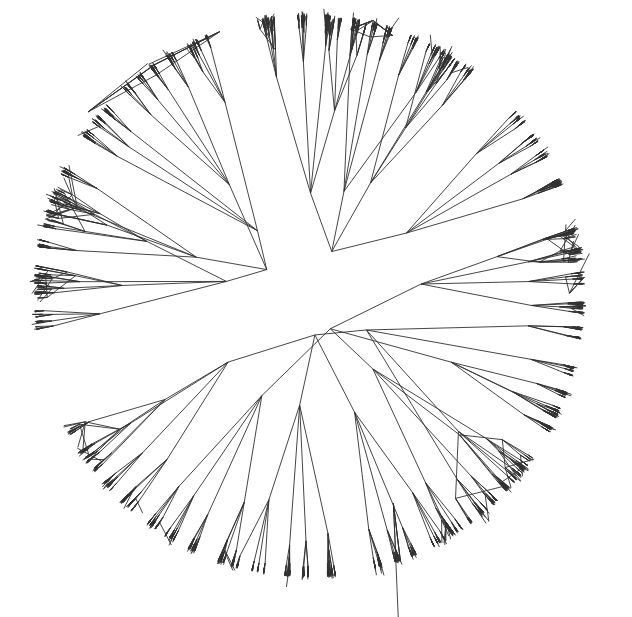

## [Hyperbolic Entailment Cones for Learning Hierarchical Embeddings](https://arxiv.org/abs/1804.01882)
### Python source code

Slides and other material can be accessed [here](http://people.inf.ethz.ch/ganeao/).

This code was built starting from the [Gensim implementation](https://rare-technologies.com/implementing-poincare-embeddings/) of Poincare embeddings [1].

1. Prerequisites:
```
pip3 install --upgrade gensim
pip3 install numpy joblib click plotly prettytable smart_open autograd
```

2. Create a [Plotly](https://plot.ly/python/) account and change your credentials in the file `animation_train.py:30`.

3. Run our hyperbolic entailment cones on WordNet data or synthetic tree data (representing a uniform tree of some fixed branching factor and some fixed depth). These trees are in data/toy/ or data/maxn/. When embedding dimension is 2, this code will produce an animation of embeddings evolving during training (e.g. [this video](https://www.youtube.com/watch?v=qCVN-61VJXg)) and the animation will be opened in your default web browser at the end of the training. Our hyperbolic embeddings are first initialized with Poincare embeddings of [1] for a number of epochs, and then hyperbolic cones are trained on top of these embeddings. By running the following commands, at the end of the videos one can obtain the pictures from Figure 3 in our paper:
```
python3 animation_train.py --tree='toy' --model='hyp_cones' --dim=2
python3 animation_train.py --tree='toy' --model='poincare' --dim=2
python3 animation_train.py --tree='wordnet_mammals' --model='hyp_cones' --dim=2
python3 animation_train.py --tree='wordnet_mammals' --model='poincare' --dim=2
```



4. Run the code to reproduce results from Table 1. Data from data/maxn/ folder was downloaded from https://github.com/facebookresearch/poincare-embeddings and splitted using `split_wordnet_data.py`. To run different jobs, one has to first set the desired hyperparameters of different models in the file `params.py` and then run:
```
python3 all.py
```

The above will run each job specified in the file `params.py` for each setting described in Table 1 of our paper. 

 
Results for each model specified in the file `params.py` will be logged in different files in the directory `logs/`. One specific run can be monitored during training using, for example, the command:

```
tail -f logs/task_25percent#dim_5#class_HypCones#init_class_PoincareNIPS#neg_sampl_strategy_true_neg#lr_0.0003#epochs_300#opt_rsgd#where_not_to_sample_children#neg_edges_attach_parent#lr_init_0.03#epochs_init_100#neg_sampl_strategy_init_true_neg
```

At the end of the training, to see the test F1 score corresponding to the best validation F1 score for our hyperbolic cones method, one can do a `grep` as follows:
```
for i in `ls ./logs/task_25percent#dim_5#*` ; do echo $i; cat $i |  grep best | grep CONES | grep OVERALL ; done | grep -A1 'HypCones' ;for i in `ls ./logs/task_25percent#epochs*` ; do echo $i; cat $i |  grep best | grep CONES | grep OVERALL  ; done
```

See the comments in the file `params.py` to understand how to select the test F1 score  corresponding to the best validation F1 score for other baselines:
```
params.py:49
params.py:57
params.py:65
```

Simple Euclidean and our Euclidean Cones baselines are not shown in  the file `params.py`, but one can run them based on the implementations in `eucl_cones_model.py` and `eucl_simple_model.py` files.

Sometimes initialization might affect the results, so it is recommended to run the same method with different random seeds (modifying the seed in `params.py:13`). 

[1] Maximilian Nickel, Douwe Kiela - "Poincaré Embeddings for Learning Hierarchical Representations", NIPS'17


## References
If you find this code useful for your research, please cite the following paper in your publication:
```
@article{ganea2018hyperbolic,
  title={Hyperbolic Entailment Cones for Learning Hierarchical Embeddings},
  author={Ganea, Octavian-Eugen and B{\'e}cigneul, Gary and Hofmann, Thomas},
  journal={arXiv preprint arXiv:1804.01882},
  year={2018}
}
```
